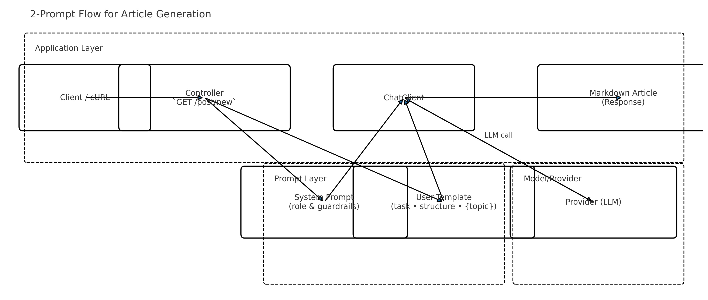

cat << 'EOF' > README.md
# 🔒 Troubleshooting: GH013 Push Protection & Secret Scanning

When you see an error like:

\`\`\`
remote: error: GH013: Repository rule violations found for refs/heads/main.
remote:
remote: - GITHUB PUSH PROTECTION
remote:   —————————————————————————————————————————
remote:     Push cannot contain secrets
remote:       —— OpenAI API Key —————————————————————————————
remote:        locations:
remote:          - commit: 5af9c022babf4980cf04fc9693a856c62cd4b945
remote:            path: .env:1
\`\`\`

it means **GitHub’s Push Protection** feature detected a secret (your OpenAI API key) in your commits and blocked the push.

---

## 🔍 Why This Happens

- **Secret Scanning**: GitHub scans every push for patterns that look like credentials (\`sk-…\` tokens, API keys, passwords).
- **Repository Rules**: Your repo has a rule to reject any push containing detected secrets.
- **.env File**: You committed your \`.env\` (which holds \`OPENAI_API_KEY=sk-…\`), so GitHub flagged it.

---

## 🛠 Solution & Step-by-Step Fix

1. **Stop Tracking \`.env\`**  
   \`\`\`bash
   echo ".env" >> .gitignore
   git rm --cached .env
   git add .gitignore
   git commit -m "chore: ignore .env and remove from index"
   \`\`\`

2. **Purge \`.env\` from Commit History**

    - **Option A: \`git filter-repo\`** (if installed)  
      \`\`\`bash
      git filter-repo --invert-paths --path .env
      \`\`\`

    - **Option B: Built-in \`filter-branch\`**  
      \`\`\`bash
      git filter-branch --force \
      --index-filter "git rm --cached --ignore-unmatch .env" \
      --prune-empty \
      --tag-name-filter cat \
      -- --all
      \`\`\`

3. **Force-Push the Clean History**
   > **Warning**: This rewrites shared history. Inform collaborators before proceeding.  
   \`\`\`bash
   git reset --hard HEAD
   git push origin main --force
   \`\`\`

4. **Verify on GitHub**
    - Check the **Code** view: \`.env\` should be gone.
    - Push errors about secrets should disappear.

---

## 🔑 Best Practices for Managing Secrets

- **Never commit** API keys or passwords to Git.
- Use environment variables or a secure vault.
- In CI (e.g. GitHub Actions), set your key under **Settings → Secrets**:  
  \`\`\`yaml
  env:
  OPENAI_API_KEY: \${{ secrets.OPENAI_API_KEY }}
  \`\`\`
- Keep your \`.gitignore\` up-to-date with all local/IDE artifacts and secret files.

---
EOF

# 	2.	Stage the file and commit it
git add README.md
git commit -m "docs: add troubleshooting guide to README.md"

# 	3.	Push the changes to GitHub
git push origin main 

--- 
# Spring AI Features — One-Table Professional Overview

A one-glance, production-oriented cheatsheet for the **five core Spring AI features**.

| Feature | What it does (purpose) | When to use (typical cases) | Minimal config / API (1-liners) | Visual flow |
|---|---|---|---|---|
| **Reference Documentation** | The authoritative source for **starters, property keys, auto-config** and provider capabilities. Keeps your app aligned with the correct versions. | Project setup, adding a new provider, fixing “bean not found” or wrong property errors. | **Maven:** `spring-ai-openai`, `spring-ai-gemini` (pick what you use). **Props:** `spring.ai.openai.api-key=${OPENAI_API_KEY}`, `spring.ai.openai.chat.enabled=true` (similar for Gemini). **Smoke test:** a tiny `/ping` returning content. | 🧑‍💻 → `Controller` → `ChatClient` → ☁️ LLM |
| **Prompts & Prompt Templates** | Standardize **role, goal, constraints, format** to get predictable outputs and brand-consistent tone. | User help, explanations, summaries, instructions with strict tone/length rules. | `client.prompt().system("role").user("Explain {topic}…").call().content()` (fill `{topic}` at runtime). Keep constraints short but strict (language, length, bullets, “no extra text”). | 🧩 Template → 🔁 Reuse → ✅ Consistent reply |
| **Structured Output** | Force the model to emit **valid JSON**, then map to a **DTO** for type-safe processing (parsing/validation becomes trivial). | Data capture, forms, scoring, compliance, downstream services/DB. | Prompt: “**Return ONLY VALID JSON** { …schema… }”. Read: `om.readValue(json, MyDto.class)`. Add validation (enum fields, booleans). | 🔤 Prompt → 🧠 LLM → 📦 JSON → 🔧 DTO |
| **Multimodal (Text, Images & Audio)** | Combine text with **images** and/or **audio** for richer understanding or generation. | Document/receipt Q&A, screenshot analysis, voice notes, captions. | `prompt.user(u -> u.text("Find total due").media("image/png", url))` (vision-capable model). Mind input size limits and supported media types. | 🖼️/🔊 + ✍️ → 🧠 → 🗒️ Answer |
| **Chat Memory** | Preserve **conversation state** to keep context and personalize responses (previous Q&A, preferences). | Assistants, customer support, multi-turn tasks. | Use a **conversationId** + store last N messages (in-memory/Redis/DB). Example flow: `mem.get(convId) -> build prompt -> call -> mem.add(convId, Q/A)`. Consider TTL and summarization for long threads. | 🧑‍💻 ↔️ 🗂️ Memory ↔️ 🧠 |

---

### Quick Implementation Notes
- **Pick providers explicitly**: enable only what you use (e.g., `spring.ai.openai.chat.enabled=true`, `spring.ai.gemini.chat.enabled=true`).
- **Secrets**: never commit `.env`; use env vars locally and **GitHub Secrets** in CI/CD.
- **Latency/Cost**: keep prompts compact; prefer **structured output** over free text when data feeds downstream services.
- **Memory at scale**: use Redis/DB + **summarization** to cap tokens and speed up calls.
- **Observability**: log prompt/response metadata (latency, token usage, model) and track error rates.

> Visual key: 🧑‍💻 client · 🧩 template · 🧠 model · ☁️ provider · 🗂️ memory · 📦 JSON/DTO  
> With this single table, you can brief stakeholders, onboard teammates, and guide implementation quickly. 

--- 
# 🧠 Spring AI — 2-Prompt Pattern for Article Generation 



A production-minded guide that standardizes content generation using **two prompts**:
1) **System Prompt** (role & guardrails)
2) **User Prompt Template** (task, structure, constraints, variables)

This pattern yields **predictable**, **brand-safe**, and **ready-to-publish** outputs.

---

## Why the 2-Prompt Pattern?
- **Separation of concerns:** durable rules (System) vs. per-request task (User)
- **Consistency:** same tone/quality across all topics
- **Testability:** templates are versionable; params are validated
- **Lower rework:** clear constraints → fewer retries

---

## Prompt 1 — System (Role & Guardrails)
**Purpose:** set the *author persona*, safety, and quality bar once; reuse everywhere.

```text
You are a senior financial content writer for a tier-1 bank.
Write clearly, factually, and avoid fabrications. If a claim is uncertain, say so.
Prefer concise, trustworthy explanations. Comply with brand tone and privacy/security standards. 
```
--- 
# 2-Prompt Flow — Quick README

This summary explains the **two-prompt** (System + User Template) approach we use for article generation, how the flow works, and why it’s useful.

---

## Flow

- **Client / cURL → Controller (`/post/new`)**  
  The user calls the endpoint via browser/cURL. The Controller is the entry point that triggers content generation.

- **Controller → Prompt Layer (System + User Template)**
   - **System Prompt:** Durable rules/role (trust, tone, factual accuracy).
   - **User Template:** Task for this request + structure + variables (e.g., `{topic}`).
   - **Why separate?** Ensures consistency and reusability.

- **System + User → ChatClient**  
  `ChatClient` merges both prompts and prepares a provider-specific request (OpenAI/Gemini, etc.). The selected provider is configured in `application.properties`.

- **ChatClient ⇄ Provider (LLM call)**  
  The model is called; using the rules (System) and task (User), it produces a **Markdown article**. The response returns via `ChatClient`.

- **ChatClient → Markdown Article Response**  
  The Controller returns the content as `text/markdown`. The structure—**title + intro + 3 insights + conclusion**—is enforced by the template.
---

## Why This Design?

- **Separation of concerns:** System = durable rules, User = per-request task → clean architecture.
- **Consistency & testability:** Templates are versioned; parameters like `{topic}` are easy to test.
- **Provider-agnostic:** With `ChatClient`, switching between OpenAI and Gemini is straightforward.
- **Production-ready:** Output in Markdown/JSON is predictable and easy for frontends/services to consume.

---

## Where to Extend (Advanced)

- **Structured Output:** Add “**return only valid JSON**” to the prompt and parse into a DTO (after `ChatClient`).
- **Memory:** Pass a `conversationId` and inject prior messages into the Prompt Layer.
- **Observability / CI:** Log latency, token usage, and model name; run build/tests with GitHub Actions.

---